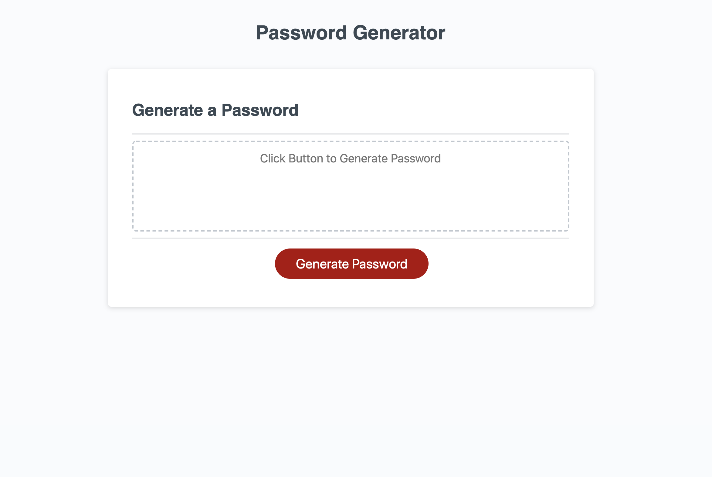
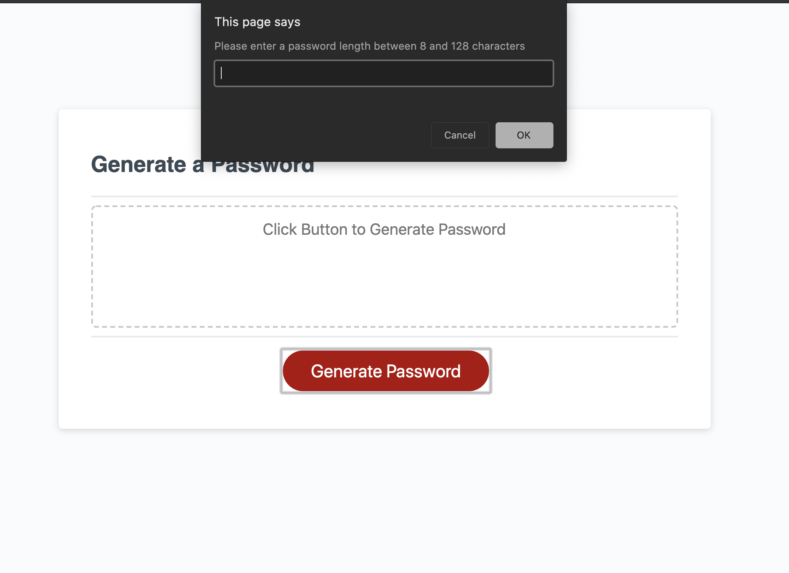
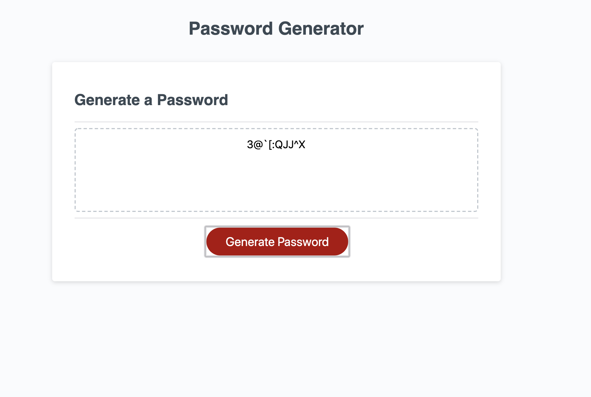

# Password Generator Refactor

## Purpose
This password generator prompts the user through a series of questions to set their unique password requirements. It then generates a random password according to the user's selected criteria and password length.

## Built With
* HTML
* CSS
* JavaScript

## Website
https://mallynnk.github.io/password-generator/

## Screenshot
 
 
 

## Contribution
Mallory Korpics
